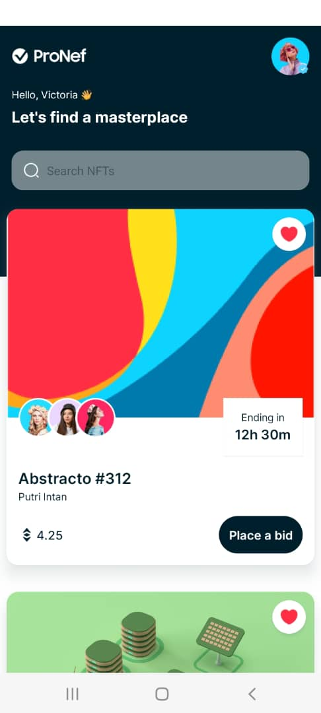
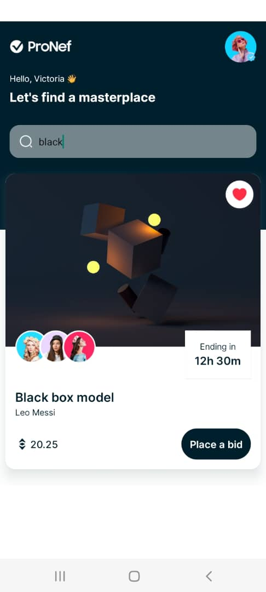
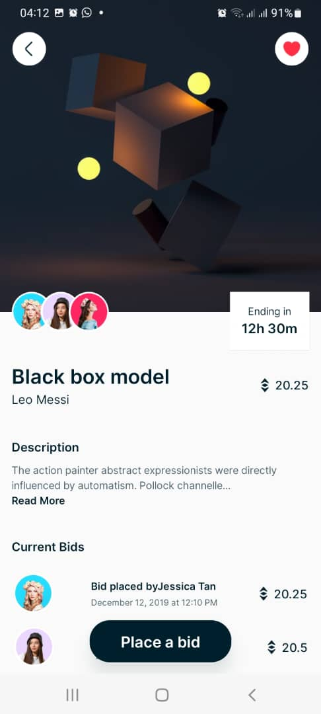
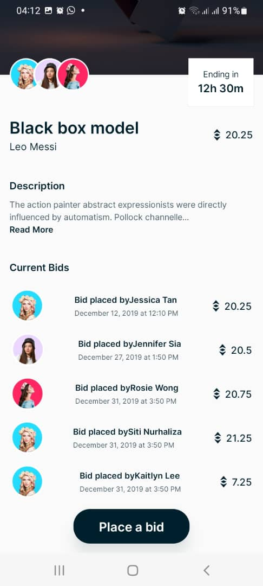

# nft_marketplace

This mobile app developed with React Native which is marketplace which is a platform that can be use to connect sellers of nfts to buyers.

# Classes

This project have 5 java classes

1. DetailActivity
2. DetailBidsActivity
3. DetailDescActivity
4. NFTCardActivity
5. SubInfoActivity

# Layouts

This project have 7 major Layouts

1. Home Layout
2. Detail Layout

# Click on Google Drive Icon Below to download apk

# Click on Expo React Native Icon Below to download apk

# Screenshots

&nbsp;
&nbsp;
&nbsp;
&nbsp;

# Author : Alabi Temitope 
